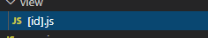
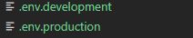

# 알게된 점



```javascript
// 위 사진처럼 NextJs 에서 의 파일명을 [] 묶어 사용하면 모든 패스의 값이 전달되며
import {useRouter}
// 를 통하여
const router = useRouter()
router.query.(id)

// 를 통하여 접근가능하다
```

```javascript
export async function getServerSideProps(context) {
  const id = context.params.id;

  return {
    props: {
      item: data,
    },
  };
}

// getServerSideProps 를 통하여 접속 전 렌더링을 하여 부드럽게 페이지 전환이 가능하다

// 첫 인자인 context 에는 context.params.[경로] 로 접근이 가능하다

// return 안의 값으로 item 이 출력되었으므로

function Test({ item }) {
  // 등으로 받아올 수 있다
}
```



```javascript
// 루트 폴더에 위와같이 env 파일 설정이 가능하며 어디서든지
process.env.(변수명)
// 으로 접근이 가능하다 하지만 브라우저 상에서 접근이 가능한 문자열을 위해선 앞에
NEXT_PUBLIC_{변수명}
// 으로 입력해주어야 한다
```
