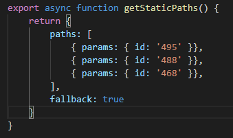
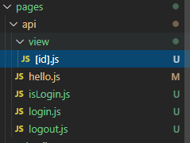
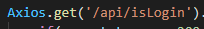
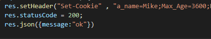
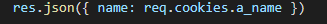

https://next-js-tutorial-black.vercel.app/

# 알게된 점


```javascript
// 위 사진처럼 NextJs 에서 의 파일명을 [] 묶어 사용하면 모든 패스의 값이 전달되며
import {useRouter}
// 를 통하여
const router = useRouter()
router.query.(id)

// 를 통하여 접근가능하다
```

```javascript
export async function getServerSideProps(context) {
  const id = context.params.id;

  return {
    props: {
      item: data,
    },
  };
}

// getServerSideProps 를 통하여 접속 전 렌더링을 하여 부드럽게 페이지 전환이 가능하다

// 첫 인자인 context 에는 context.params.[경로] 로 접근이 가능하다

// return 안의 값으로 item 이 출력되었으므로

function Test({ item }) {
  // 등으로 받아올 수 있다
}
```


```javascript
// 루트 폴더에 위와같이 env 파일 설정이 가능하며 어디서든지
process.env.(변수명)
// 으로 접근이 가능하다 하지만 브라우저 상에서 접근이 가능한 문자열을 위해선 앞에
NEXT_PUBLIC_{변수명}
// 으로 입력해주어야 한다
```



```javascript
//  위 코드는 [id].js 파일이 있다는 가정 하에 id 값이 495, 488, 468 인 페이지들은 build 과정에서 미리 렌더링 해 놓는다는 뜻이다 (빠르게 화면이 나타남)

// 즉 나머지의 경우 사용자가 접근할 때 렌더링 됨

// fallback 옵션이 false 일 경우 위 id 를 제외한 나머지 경로는 모두 404 Error 를 출력한다
```



```javascript
// pages 폴더의 api 안에 js 파일을 만들게 되면 해당 주소로 접근할 경우 json 형식의 api를 줄 수 있다.
```



```javascript
// 전체 주소가 아닌 /api/(폴더명) 으로 접근해야한다
```



```javascript
// 해당 방법으로 쿠키를 설정할 수 있다
```



```javascript
// 해당 방법으로 쿠키를 읽어온다.
```
